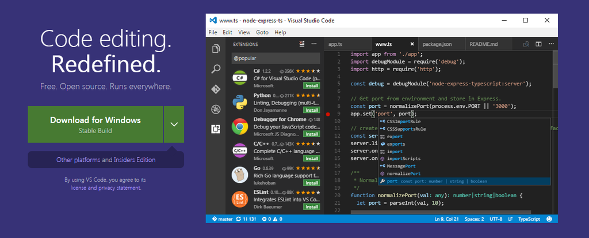

# Visual Studio Code (VSCode)

## 目錄

- [特性介紹](./feature.md)

- [推薦套件](./package.md)

- 設定檔

  - 編輯器全域設定
    
    - [OSX](setting/setting-osx.json)
    
    - [Windows](setting/setting-windows.json)

   - 程式碼片段設定

      - [Javascript(.js)](setting/javascript.json)
 

## 常用快速鍵

需安裝 Keisuke Kato/IntelliJ IDEA Keybindings

| 快速鍵功能 | OSX快速鍵 | Windows快速鍵 |
|:----|:---------|:-------------|
| 上一個游標位置 | Alt+Cmd+左 | Ctrl+左 |
| 下一個游標位置 | Alt+Cmd+右 | Ctrl+右 |
| 整列程式碼上下移動 | Shift+Cmd+上或下 | Shift+Ctr+上或下 |
| 複製整列程式碼 | Cmd+D | Ctrl+D |
| 重新命名檔案 | Shift+F6 | Shift+F6 |
| 關閉Tab視窗 | Cmd+W | Ctrl+F4 |
| 新增VSCode視窗 | Shift+Cmd+ N | 暫無 |
| 輸入關鍵字查找檔名並開啟檔案 | Shift+Cmd+O | Shift+Ctrl+N |
| 跳至指定行位置 | Cmd+L | Ctrl+G |
| 多行選取(可跳行) | Shift+Alt+滑鼠壓住移動 | Shift+Alt滑鼠壓住移動 | 
| 開啟終端機 | Shift+Control+` | Shift+Ctrl+` |
