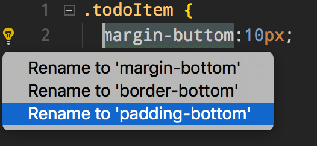
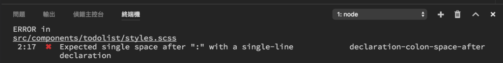
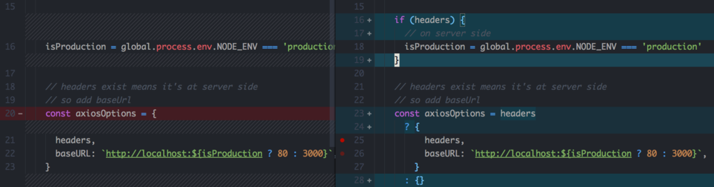
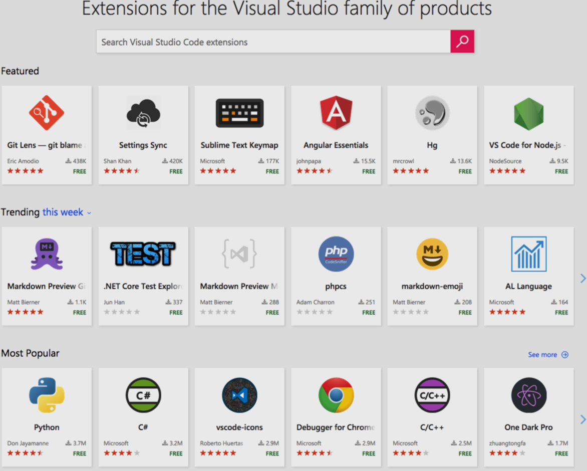
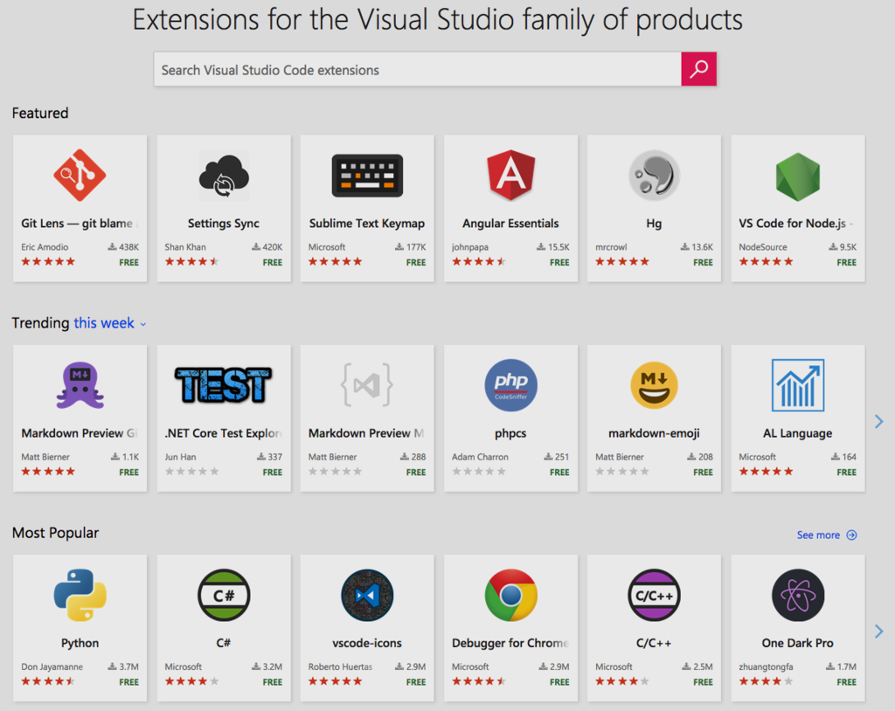

## 特性介紹

1. 拼寫修正 (友情提示,點擊自動修正)

2. 根據檔名或是引用跳到檔案, 偵錯跳轉

3. CSS色碼顯示與直接調整

4. 內建Git版本控制

5. Emmet Snippets (可自定義程式碼片段)

6. 自動格式化程式碼

7. 自定義常用的程式碼片段

8. 好看的檔案 ICON

9. 強大的 Intellisense

10. 多行選取(Multi Cursor)

11. 斷點除錯 Debug

12. 內建嵌入終端機

13. 活躍的社群

